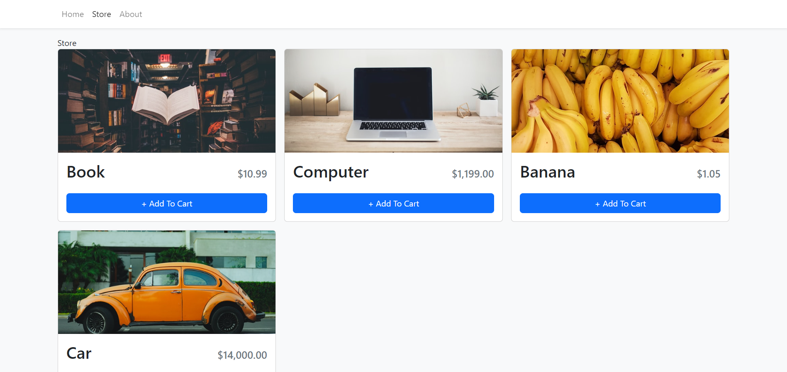
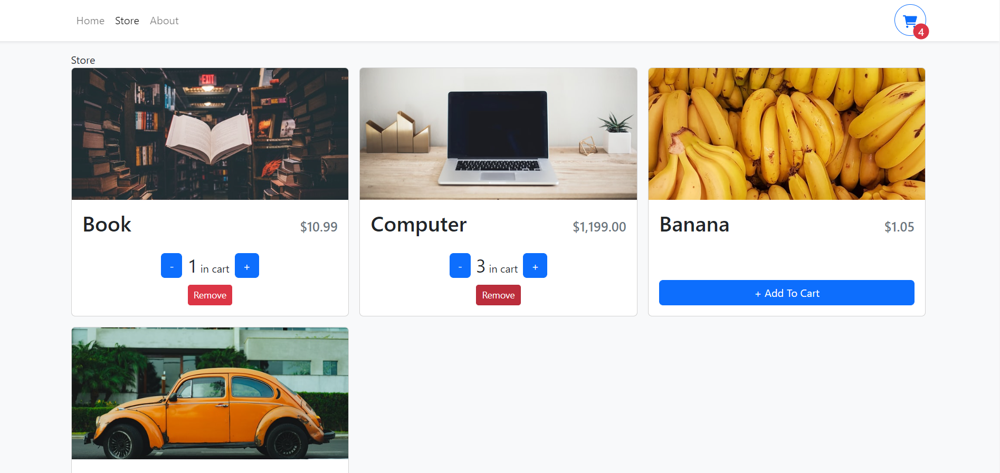

<h1 align="center"><i>Shopping cart</i></h1>

**_
Shopping cart application with React library and Typescript. Only the Store page has content, with the ability to add an unlimited number of products to the cart. It is also possible to delete them and change the quantities.
_**

    

    <h2 align="center">Store</h2>
    
    

    <h2 align="center">Some Quantity</h2>
    
    

    <h2 align="center">Cart</h2>
    
    

<h2>Setup:</h2>

<h3>For client side is used React library with Typescript</h3>
<h4>To start: npm run dev</h4>

Used technologies:

- <i><b>JavaScript with React library</b></i>
- <i><b>Typesript</b></i>
- <i><b>HTML</b></i>
- <i><b>CSS</b></i>

Dependencies, (besides Create-React-App deps): 

- React Router v6
- bootstrap
- react-bootstrap

